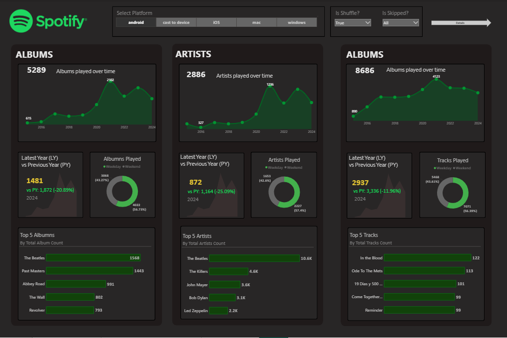
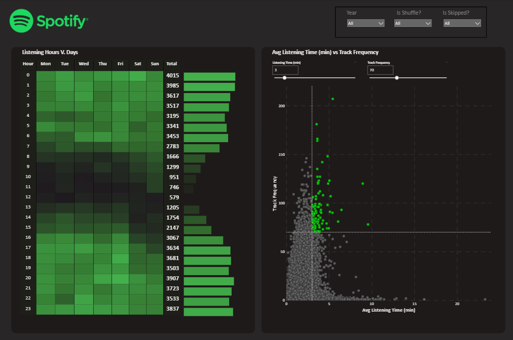
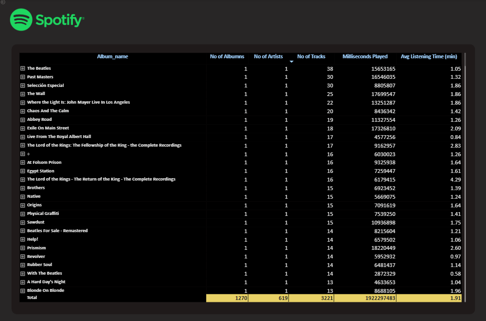

# 🎵 Spotify Data Analysis & Power BI Dashboard

_An interactive Power BI dashboard providing insights into listening habits, track features, and artist popularity based on Spotify data._

---

## 📊 Table of Contents
- <a href="#project-overview">Project Overview</a>
- <a href="#problem-statement">Problem Statement</a>
- <a href="#dataset">Dataset</a>
- <a href="#tools--technologies">Tools & Technologies</a>
- <a href="#project-workflow">Project Workflow</a>
- <a href="#key-insights">Key Insights</a>
- <a href="#how-to-use-this-project">How to Use This Project</a>
- <a href="#contact">Contact</a>

---
<h2>project-overview</h2>

This project analyzes a dataset of Spotify tracks to uncover trends and patterns in music. The primary goal is to explore the relationships between audio features (like danceability, energy, and valence) and track popularity. The final output is an interactive and user-friendly dashboard built in Power BI that allows users to dynamically explore the findings.

---
<h2>❓ Problem Statement</h2>

The project aims to answer several key questions about music trends on Spotify:
- What are the defining audio characteristics of the most popular songs?
- How have music trends (e.g., energy, acousticness) evolved over the last few decades?
- Which artists have the most popular tracks, and what do their top songs have in common?
- Is there a measurable correlation between a track's loudness, energy, or danceability and its overall popularity score?

---
<h2>💾 Dataset</h2>

The dataset used for this analysis is the Spotify Tracks Dataset from Kaggle. It contains information on over 100,000 tracks with various audio features and metadata.

Key Features Include:

**artists**: Name of the artist(s).

**album_name**: Name of the album.

**track_name**: Name of the track.

**opularity**: The popularity of the song, from 0 to 100.

**duration_ms**: The duration of the track in milliseconds.

**track_genre**: The genre of the track.

---
<h2>🛠️ Tools & Technologies</h2>

- Data Cleaning & Transformation: Power Query (within Power BI) for handling missing values, filtering data, and creating calculated columns.

- Data Analysis: DAX (Data Analysis Expressions) for creating measures and complex calculations.

- Data Visualization: Power BI for creating interactive charts, graphs, and slicers.

- Version Control: Git & GitHub for project management and documentation.

---
<h2>⚙️ Project Workflow</h2>

- Data Loading: The CSV dataset was imported directly into Power BI.

- Data Cleaning & Transformation: Using Power Query, the data was cleaned to handle duplicates, null values, and irrelevant columns. New columns, such as duration_min (duration in minutes), were created for better analysis.

- DAX Measures: Key measures were created using DAX to calculate metrics like Average Popularity, Average Danceability, and Total Track Count.

- Dashboard Design: An interactive dashboard was designed with a logical layout, including slicers for genre and year, to allow for easy filtering and exploration.

- Visualization: A variety of visuals were used to represent the data, including bar charts for top artists, line charts for trends over time, and scatter plots to show correlations between audio features and popularity.

---
<h2>💡 Key Insights</h2>

1. **Popularity & Danceability**: A moderate positive correlation was found between a track's danceability and its popularity, suggesting that more danceable songs tend to be more popular.

2. **Trends Over Time**: The analysis revealed a steady increase in the average energy and loudness of tracks since the 1980s.

3. **Top Genres**: Pop, Rock, and Hip-Hop were identified as the genres with the highest average popularity scores across the dataset.

---
<h2>🖥️ Dashboard Showcase</h2>

Below is a screenshot of the main dashboard. The interactive Power BI file (.pbix) is available in this repository.

---
<h2>🚀 How to Use This Project</h2>

To explore the dashboard and the analysis yourself:

1. Clone the repository:

2. git clone https://github.com/Harshad-hd/spotify-data-analysis-powerbi.git

3. Download Power BI Desktop: If you don't have it already, download it from the official Microsoft website.

4. Open the file: Navigate to the project directory and open the .pbix file.

5. Interact: Use the slicers and filters to explore the data and insights.

---
<h2>📞 Contact</h2>

**Harshad Mourya**
Data Analyst
📧 Email: mouryaharshad@gmail.com
🔗 [LinkedIn](https://www.linkedin.com/in/harshad-mourya/)